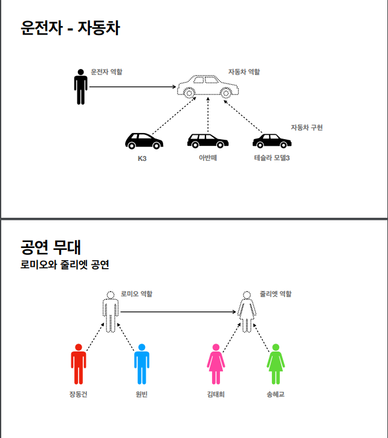
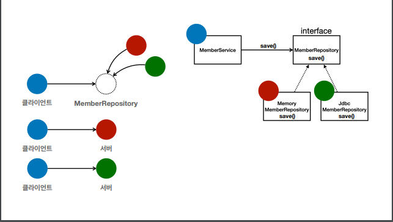

### 스프링 특징

- 스프링은 자바 언어 기반 (**객체 지향 언어**)
- 스프링은 객체 지향 언어가 가진 강력한 특징을 살려내는 프레임워크

### 객체 지향 특징

- 추상화
- 캡슐화
- 상속
- **다형성**

#### 다형성 비유

다형성은 **역할과 구현**을 분리하는것

- 역할 = 인터페이스
- 구현 = 인터페이스를 구현한 클래스
- 객체를 설계할 때 역할과 구현을 완전히 분리
- 객체 설계시 인터페이스를 먼저 부여하고, 역할을 수행하는 구현 객체 만들기

## 좋은 객체 지향 설계의 5가지 원칙(SOLID)

- SRP : 단일 책임 원칙 (single resposibility principle)

- OCP : 개방 - 패쇄 원칙 (Open/closed principle)
- LSP : 리스코프 치환 원칙 (Liskov substitution principle)
- ISP : 인터페이스 분리 원칙 (Interface segregation principle)
- DIP : 의존관계 역전 원칙 (Dependecy inversion principle)

### SRP

- 한 클래스는 하나의 책임만 가져야 한다
- **기준은 변경**이다. 변경이 있을 때 파급 효과가 적으면 단일 책임 원칙을 잘 따른 것

### OCP

- 소프트웨어 요소는 **확장에는 열려** 있으나 변경에는 닫혀 있어야 한다
- 다형성을 이용해도 구현 객체를 변경하려면 클라이언트 코드를 변경해야 한다
- 객체를 생성하고 연관관계를 맺어주는 별도의 조립, 설정자가 필요하다(**DI**)

### LSP

- 프로그램의 객체는 프로그램의 정확성을 깨뜨리지 않으면서 하위 타입의 인스턴스로 바꿀 수 있어야 한다
- 다형성에서 하위 클래스는 인터페이스 규약을 다 지켜야 한다는 것, 다형성을 지원하기 위 한 원칙, 인터페이스를 구현한 구현체는 믿고 사용하려면, 이 원칙이 필요하다
- 예) 자동차 인터페이스의 엑셀은 앞으로 가라는 기능, 뒤로 가게 구현하면 LSP 위반, 느리 더라도 앞으로 가야함

### ISP

- 특정 클라이언트를 위한 인터페이스 여러 개가 범용 인터페이스 하나보다 낫다
- 인터페이스 자체가 변해도 클라이언트에 영향을 주지 않는 것
- 인터페이스가 명확해지고, 대체 가능성이 높아진다

### DIP

- 구현 클래스에 의존하지 말고, 인터페이스에 의존해야 한다
- 즉, 인터페이스에 의존해야 한다
- 구현체에 의존하게 되면 변경이 용이하지 못하다

