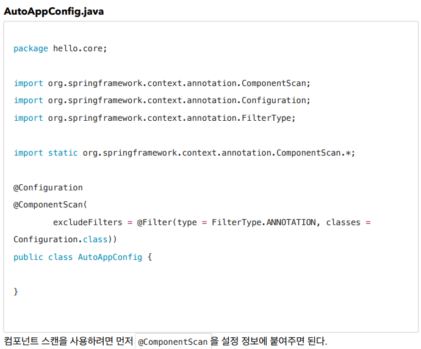

## 컴포넌트 스캔

- 스프링 빈을 등록할 때는 자바 코드의 @Bean이나 XML의 <bean> 등을 통해서 설정 정보에
  직접 등록할 스프링 빈을 나열했다.
- 스프링은 설정 정보가 없어도 자동으로 스프링 빈을 등록하는 컴포넌트 스캔이라는 기능을
  제공한다.
- 또한 의존관계도 자동으로 주입하는 @Autowired 라는 기능도 제공한다.

- 평소 사용시에는 @CompoentScan만 적으면 된다 Filter는 기존 AppConfig의 Bean들을 걸러주기 위함

#### 컴포넌트 스캔과 자동 의존관계 주입의 동작

### @ComponentScan

### @Autowired

- 컴포넌트 스캔 탐색 위치와 기본 스캔 대상
- basePackages : 탐색할 패키지의 시작 위치를 지정한다. 이 패키지를 포함해서 하위 패키지를 모두
  탐색한다.
- basePackages = {"hello.core", "hello.service"} 이렇게 여러 시작 위치를 지정할 수도
  있다.
- basePackageClasses : 지정한 클래스의 패키지를 탐색 시작 위치로 지정한다.
- 만약 지정하지 않으면 @ComponentScan 이 붙은 설정 정보 클래스의 패키지가 시작 위치가 된다.

**권장하는 방법
개인적으로 즐겨 사용하는 방법은 패키지 위치를 지정하지 않고, 설정 정보 클래스의 위치를 프로젝트
최상단에 두는 것이다. 최근 스프링 부트도 이 방법을 기본으로 제공한다.**

- 컴포넌트 스캔은 @Component 뿐만 아니라 다음과 내용도 추가로 대상에 포함한다.
- @Component : 컴포넌트 스캔에서 사용
- @Controlller : 스프링 MVC 컨트롤러에서 사용
- @Service : 스프링 비즈니스 로직에서 사용

- @Repository : 스프링 데이터 접근 계층에서 사용
- @Configuration : 스프링 설정 정보에서 사용

