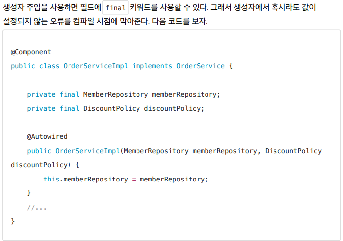
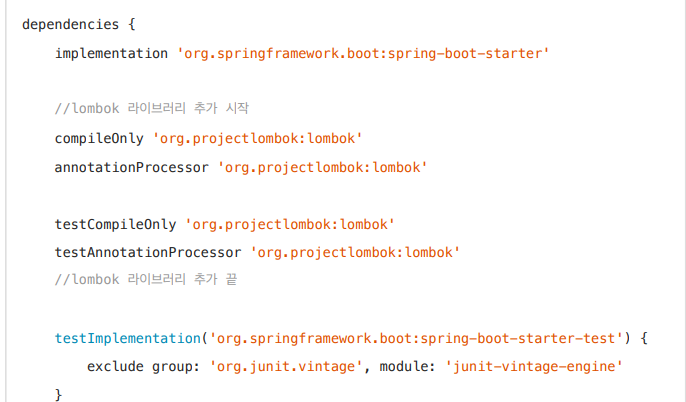
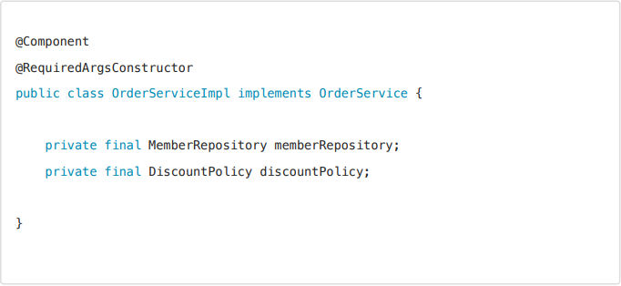
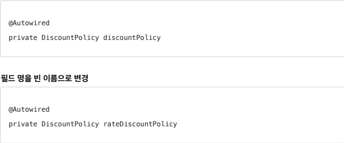
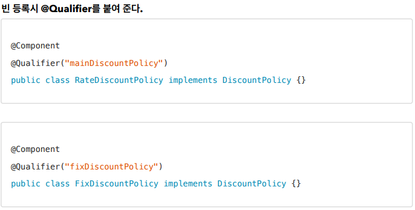
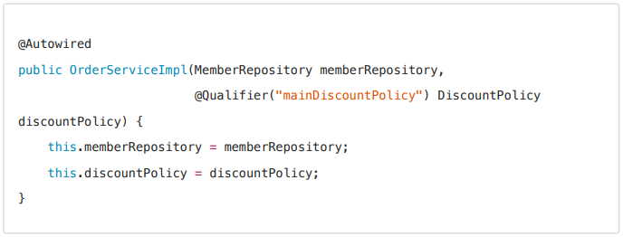
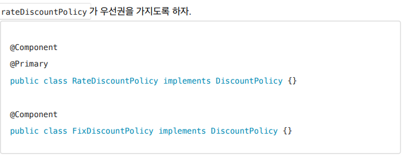

## 의존관계 자동 주입

- 의존관계 주입은 크게 4가지 방법이 있다.
- 생성자 주입
- 수정자 주입(setter 주입)
- 필드 주입
- 일반 메서드 주입

### 생성자 주입을 선택하라

과거에는 수정자 주입과 필드 주입을 많이 사용했지만, 최근에는 스프링을 포함한 DI 프레임워크 대부분이
생성자 주입을 권장한다. 

**불변**

- 대부분의 의존관계 주입은 한번 일어나면 애플리케이션 종료시점까지 의존관계를 변경할 일이 없다.
-  오히려 대부분의 의존관계는 애플리케이션 종료 전까지 변하면 안된다.(불변해야 한다.)
- 수정자 주입을 사용하면, setXxx 메서드를 public으로 열어두어야 한다.
- 누군가 실수로 변경할 수 도 있고, 변경하면 안되는 메서드를 열어두는 것은 좋은 설계 방법이 아니다.
- 생성자 주입은 객체를 생성할 때 딱 1번만 호출되므로 이후에 호출되는 일이 없다.
-  따라서 불변하게 설계할 수 있다.

-  보면 필수 필드인 discountPolicy 에 값을 설정해야 하는데, 이 부분이 누락되었다. 
- 자바는 컴파일 시점에 다음 오류를 발생시킨다.
- java: variable discountPolicy might not have been initialized
- 컴파일 오류는 세상에서 가장 빠르고, 좋은 오류다.

### 롬복 라이브러리 적용

**롬복 라이브러리 적용**

- 롬복 라이브러리가 제공하는 @RequiredArgsConstructor 기능을 사용하면 final이 붙은 필드를 모아서 생성자를 자동으로 만들어준다. (다음 코드에는 보이지 않지만 실제 호출 가능하다.)

### 조회 빈이 2개 이상일 경우 오류가 발생한다 이에 해결방안

- @Autowired 필드 명 매칭

- @Qualifier @Qualifier끼리 매칭 빈 이름 매칭

**생성자 자동 주입 예시**

- @Primary 사용

@Primary 는 우선순위를 정하는 방법이다. @Autowired 시에 여러 빈이 매칭되면 @Primary 가 우선권을
가진다.

