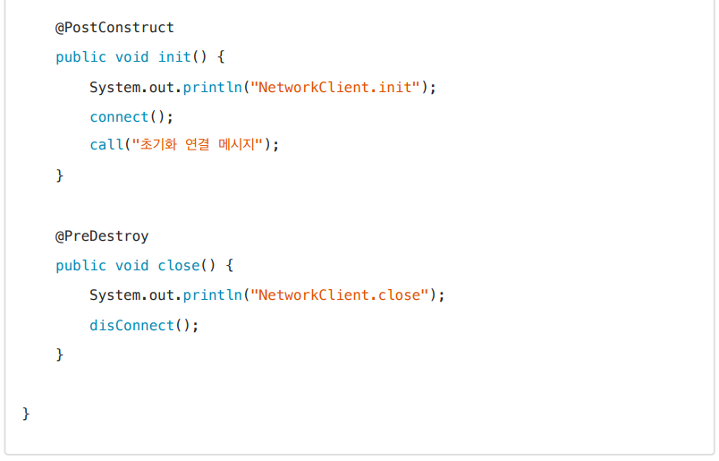

## 빈 생명주기 콜백 시작

스프링 빈은 간단하게 다음과 같은 라이프사이클을 가진다.
객체 생성 의존관계 주입
스프링 빈은 객체를 생성하고, 의존관계 주입이 다 끝난 다음에야 필요한 데이터를 사용할 수 있는 준비가
완료된다. 따라서 초기화 작업은 의존관계 주입이 모두 완료되고 난 다음에 호출해야 한다.

**스프링 빈은 간단하게 다음과 같은 라이프사이클을 가진다.
객체 생성 의존관계 주입
스프링 빈은 객체를 생성하고, 의존관계 주입이 다 끝난 다음에야 필요한 데이터를 사용할 수 있는 준비가
완료된다. 따라서 초기화 작업은 의존관계 주입이 모두 완료되고 난 다음에 호출해야 한다.**

**스프링 빈의 이벤트 라이프사이클**
**스프링 컨테이너 생성 -- 스프링 빈 생성 -- 의존관계 주입 -- 초기화 콜백 -- 사용 -- 소멸전 콜백 -- 스프링 종료**

- **초기화 콜백: 빈이 생성되고, 빈의 의존관계 주입이 완료된 후 호출**
- **소멸전 콜백: 빈이 소멸되기 직전에 호출**

스프링은 크게 3가지 방법으로 빈 생명주기 콜백을 지원한다

- 인터페이스(InitializingBean, DisposableBean)
- 설정 정보에 초기화 메서드, 종료 메서드 지정
- @PostConstruct, @PreDestroy 애노테이션 지원

### 애노테이션 @PostConstruct, @PreDestroy

**@PostConstruct , @PreDestroy 이 두 애노테이션을 사용하면 가장 편리하게 초기화와 종료를 실행할 수 있다.**

- 최신 스프링에서 가장 권장하는 방법이다.
- 애노테이션 하나만 붙이면 되므로 매우 편리하다.
- 패키지를 잘 보면 javax.annotation.PostConstruct 이다. 스프링에 종속적인 기술이 아니라 JSR-250
  라는 자바 표준이다. 
- 따라서 스프링이 아닌 다른 컨테이너에서도 동작한다.
- 컴포넌트 스캔과 잘 어울린다.
- 유일한 단점은 외부 라이브러리에는 적용하지 못한다는 것이다. 
- 외부 라이브러리를 초기화, 종료 해야 하면 @Bean의 기능을 사용하자.
