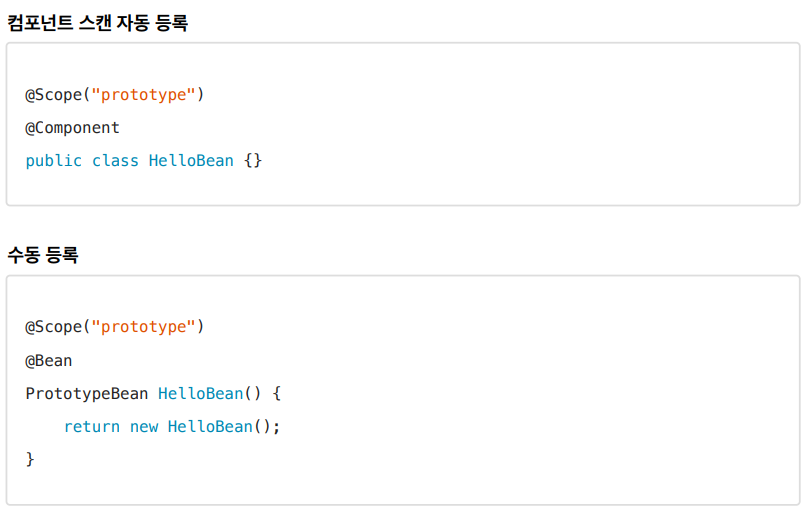

## 빈 스코프

**지금까지 우리는 스프링 빈이 스프링 컨테이너의 시작과 함께 생성되어서 스프링 컨테이너가 종료될 때**
**까지 유지된다고 학습했다. 이것은 스프링 빈이 기본적으로 싱글톤 스코프로 생성되기 때문이다. 스코프는**
**번역 그대로 빈이 존재할 수 있는 범위를 뜻한다.**

**스프링은 다음과 같은 다양한 스코프를 지원한다.**

- **싱글톤**: 기본 스코프, 스프링 컨테이너의 시작과 종료까지 유지되는 가장 넓은 범위의 스코프이다.

- **프로토타입**: 스프링 컨테이너는 프로토타입 빈의 생성과 의존관계 주입까지만 관여하고 더는 관리하지 않는
  매우 짧은 범위의 스코프이다.

- **웹 관련 스코프**
  **request:** 웹 요청이 들어오고 나갈때 까지 유지되는 스코프이다.

  **session**: 웹 세션이 생성되고 종료될 때 까지 유지되는 스코프이다.
  **application**: 웹의 서블릿 컨텍스트와 같은 범위로 유지되는 스코프이다.

### 프로토타입 스코프

**싱글톤 스코프의 빈을 조회하면 스프링 컨테이너는 항상 같은 인스턴스의 스프링 빈을 반환한다. 반면에**
**프로토타입 스코프를 스프링 컨테이너에 조회하면 스프링 컨테이너는 항상 새로운 인스턴스를 생성해서**
**반환한다.**

- 핵심은 스프링 컨테이너는 프로토타입 빈을 생성하고, 의존관계 주입, 초기화까지만 처리한다는 것이다. 
- 클라이언트에 빈을 반환하고, 이후 스프링 컨테이너는 생성된 프로토타입 빈을 관리하지 않는다. 
- 프로토타입 빈을 관리할 책임은 프로토타입 빈을 받은 클라이언트에 있다. 
- **그래서 @PreDestroy 같은 종료 메서드가 호출되지 않는다.**

#### 프로토타입 스코프 - 싱글톤 빈과 함께 사용시 문제점

#### 프로토타입 스코프 - 싱글톤 빈과 함께 사용시 Provider로 문제 해결

- 의존관계를 외부에서 주입(DI) 받는게 아니라 이렇게 직접 필요한 의존관계를 찾는 것을 Dependency 
  Lookup (DL) 의존관계 조회(탐색) 이라한다.

- ObjectFactory, ObjectProvider
- 지정한 빈을 컨테이너에서 대신 찾아주는 DL 서비스를 제공하는 것이 바로 ObjectProvider 이다.
-  참고로 과거에는 ObjectFactory 가 있었는데, 여기에 편의 기능을 추가해서 ObjectProvider 가 만들어졌다.

**ObjectFactory: 기능이 단순, 별도의 라이브러리 필요 없음, 스프링에 의존**

**ObjectProvider: ObjectFactory 상속, 옵션, 스트림 처리등 편의 기능이 많고, 별도의 라이브러리 필요**
**없음, 스프링에 의존**

**JSR-330 Provider**

마지막 방법은 javax.inject.Provider 라는 JSR-330 자바 표준을 사용하는 방법이다.
이 방법을 사용하려면 javax.inject:javax.inject:1 라이브러리를 gradle에 추가해야 한다.

- get() 메서드 하나로 기능이 매우 단순하다.
- 별도의 라이브러리가 필요하다.
- 자바 표준이므로 스프링이 아닌 다른 컨테이너에서도 사용할 수 있다.

### 웹 스코프

**웹 스코프의 특징**

- 웹 스코프는 웹 환경에서만 동작한다.
- 웹 스코프는 프로토타입과 다르게 스프링이 해당 스코프의 종료시점까지 관리한다. 따라서 종료 메서드가
  호출된다.

**웹 스코프 종류**

- request: HTTP 요청 하나가 들어오고 나갈 때 까지 유지되는 스코프, 각각의 HTTP 요청마다 별도의 빈
  인스턴스가 생성되고, 관리된다.
- session: HTTP Session과 동일한 생명주기를 가지는 스코프
- application: 서블릿 컨텍스트( ServletContext )와 동일한 생명주기를 가지는 스코프
- websocket: 웹 소켓과 동일한 생명주기를 가지는 스코프

- 웹 환경 추가,  스코프는 웹 환경에서만 동작하므로 web 환경이 동작하도록 라이브러리를 추가하자.

#### 스코프와 프록시

**스프링 애플리케이션을 실행하는 시점에 싱글톤 빈은 생성해서 주입이 가능하지만, request 스코프 빈은**
**아직 생성되지 않는다. 이 빈은 실제 고객의 요청이 와야 생성할 수 있다!**

- 가짜 프록시 객체는 내부에 진짜 myLogger를 찾는 방법을 알고 있다.
- 클라이언트가 myLogger.logic() 을 호출하면 사실은 가짜 프록시 객체의 메서드를 호출한 것이다.
- 가짜 프록시 객체는 request 스코프의 진짜 myLogger.logic() 를 호출한다.
- 가짜 프록시 객체는 원본 클래스를 상속 받아서 만들어졌기 때문에 이 객체를 사용하는 클라이언트
  입장에서는 사실 원본인지 아닌지도 모르게, 동일하게 사용할 수 있다(다형성)

**동작 정리**

- CGLIB라는 라이브러리로 내 클래스를 상속 받은 가짜 프록시 객체를 만들어서 주입한다.
- 이 가짜 프록시 객체는 실제 요청이 오면 그때 내부에서 실제 빈을 요청하는 위임 로직이 들어있다.
- 가짜 프록시 객체는 실제 request scope와는 관계가 없다. 그냥 가짜이고, 내부에 단순한 위임 로직만
  있고, 싱글톤 처럼 동작한다.

**특징 정리**

- 프록시 객체 덕분에 클라이언트는 마치 싱글톤 빈을 사용하듯이 편리하게 request scope를 사용할 수 있다.
- 사실 Provider를 사용하든, 프록시를 사용하든 핵심 아이디어는 진짜 객체 조회를 꼭 필요한 시점까지
  지연처리 한다는 점이다.
- 단지 애노테이션 설정 변경만으로 원본 객체를 프록시 객체로 대체할 수 있다.
-  이것이 바로 다형성과 DI 컨테이너가 가진 큰 강점이다.
- 꼭 웹 스코프가 아니어도 프록시는 사용할 수 있다.