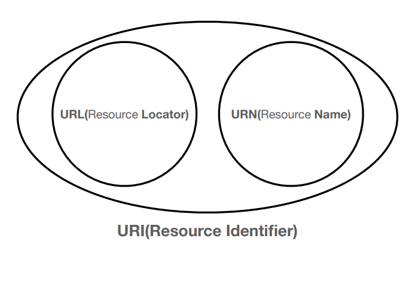

## IP 인터넷 프로토콜 

- 지정한 IP 주소(IP Address)에 데이터 전달
-  패킷(Packet)이라는 통신 단위로 데이터 전달

- 비연결성 - 패킷을 받을 대상이 없거나 서비스 불능 상태여도 패킷 전송
- 비신뢰성 - 중간에 패킷이 사라지거나 패킷이 순서대로 안올 수 있다
- 프로그램 구분 - 같은 IP를 사용하는 서버에서 통신하는 애플리케이션이 둘 이상이면 처리 불가

## TCP/UDP

### TCP 전송 제어 프로토콜(Transmission Control Protocol)

- 연결지향 - TCP 3 way handshake (가상 연결)
- 데이터 전달 보증
- 순서 보장
- 신뢰할 수 있는 프로토콜
- 현재는 대부분 TCP 사용

### UDP 사용자 데이터그램 프로토콜(User Datagram Protocol)

- 하얀 도화지에 비유(기능이 거의 없음)
- 연결지향 - TCP 3 way handshake X
- 데이터 전달 보증 X
- 순서 보장 X
- 데이터 전달 및 순서가 보장되지 않지만, 단순하고 빠름
- IP와 거의 같다. +PORT +체크섬 정도만 추가
- 애플리케이션에서 추가 작업 필요

## PORT

- 0 ~ 65535 할당 가능
- 0 ~ 1023: 잘 알려진 포트, 사용하지 않는 것이 좋음
- FTP - 20, 21
- TELNET - 23
- HTTP - 80
- HTTPS - 443

## DNS

- 전화번호부
- 도메인 명을 IP 주소로 전환

## URL, URN, URI

### URL, URN

- URL - Locator: 리소스가 있는 위치를 지정
- URN - Name: 리소스에 이름을 부여
- 위치는 변할 수 있지만, 이름은 변하지 않는다.
- urn:isbn:8960777331 (어떤 책의 isbn URN)
- URN 이름만으로 실제 리소스를 찾을 수 있는 방법이 보편화 되지 않음

### URL 전체 문법

scheme://[userinfo@]host[:port][/path][?query][#fragment]
https://www.google.com:443/search?q=hello&hl=ko

• 프로토콜(https)
• 호스트명(www.google.com)
• 포트 번호(443)
• 패스(/search)
• 쿼리 파라미터(q=hello&hl=ko)