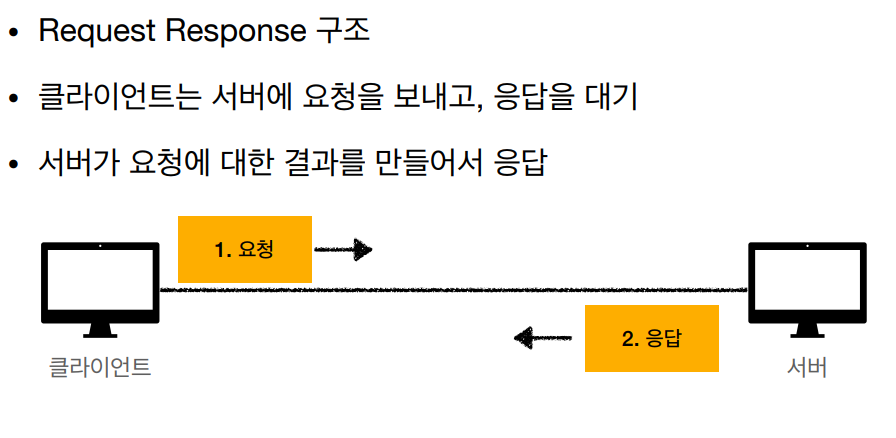
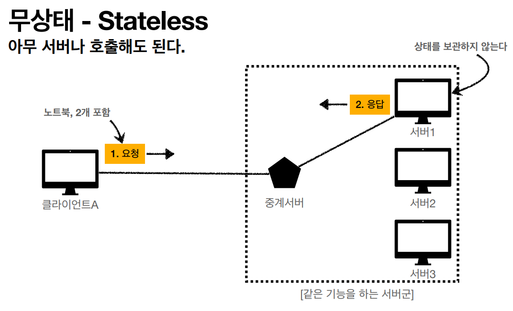
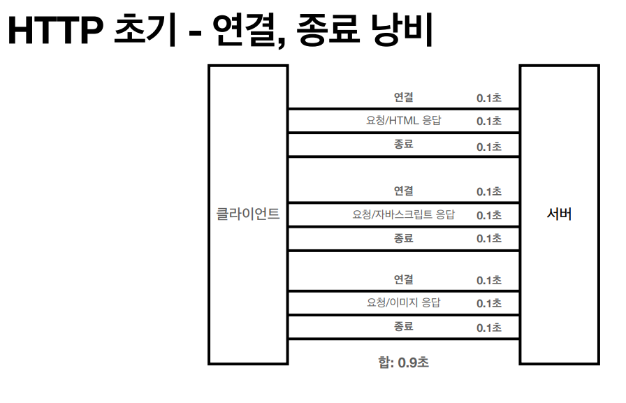
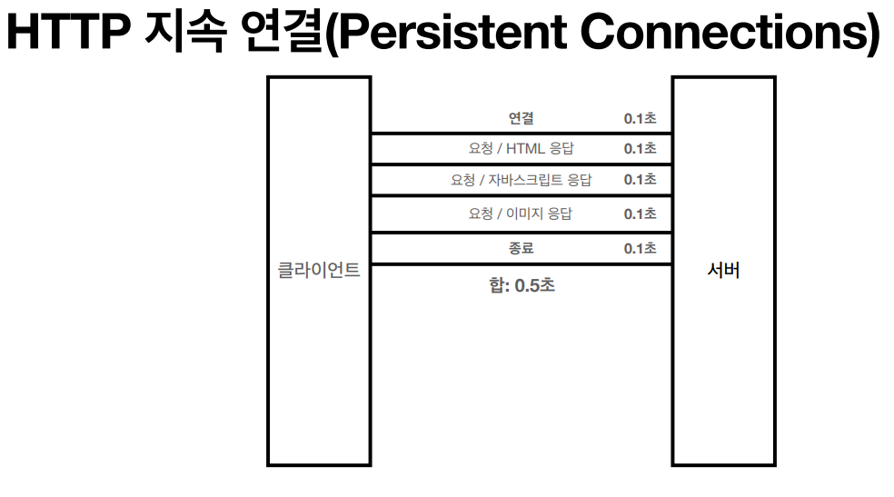
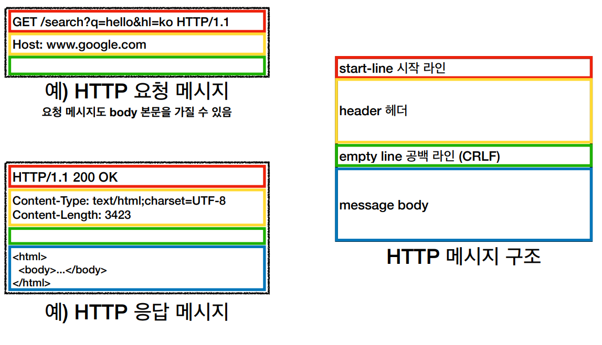

## HTTP 메세지에 모든것을 전송

- HTML, TEXT
- IMAGE, 음성, 영상, 파일
- JSON, XML (API)
- 거의 모든 형태의 데이터 전송 가능
- 서버간에 데이터를 주고 받을 때도 대부분 HTTP 사용

### HTTP 특징

- **클라이언트 서버 구조**

- **무상태 프로토콜(스테이스리스)**

​	• 서버가 클라이언트의 상태를 보존X
​	• 장점: 서버 확장성 높음(스케일 아웃)
​	• 단점: 클라이언트가 추가 데이터 전송

- **비연결성**

​	• HTTP는 기본이 연결을 유지하지 않는 모델
​	• 일반적으로 초 단위의 이하의 빠른 속도로 응답
​	• 1시간 동안 수천명이 서비스를 사용해도 실제 서버에서 동시에 처리하는 요청은 수십개 이하로 매우 작음
​	• 예) 웹 브라우저에서 계속 연속해서 검색 버튼을 누르지는 않는다.
​	• 서버 자원을 매우 효율적으로 사용할 수 있음

- **HTTP 메시지**

