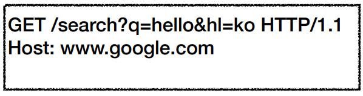
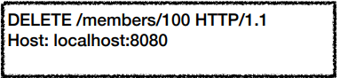

## HTTP 메서드

### HTTP 메서드 종류

- **GET: 리소스 조회**

​	• 리소스 조회
​	• 서버에 전달하고 싶은 데이터는 query(쿼리 파라미터, 쿼리 스트링)를 통해서 전달
​	• 메시지 바디를 사용해서 데이터를 전달할 수 있지만, 지원하지 않는 곳이 많아서 권장하지 않음

- **POST: 요청 데이터 처리, 주로 등록에 사용**

​	• 요청 데이터 처리
​	• 메시지 바디를 통해 서버로 요청 데이터 전달
​	• 서버는 요청 데이터를 처리
​	• 메시지 바디를 통해 들어온 데이터를 처리하는 모든 기능을 수행한다.
​	• 주로 전달된 데이터로 신규 리소스 등록, 프로세스 처리에 사용

​	 • 예를 들어 POST는 다음과 같은 기능에 사용됩니다.

​		• HTML 양식에 입력 된 필드와 같은 데이터 블록을 데이터 처리 프로세스에 제공
​			• 예) HTML FORM에 입력한 정보로 회원 가입, 주문 등에서 사용

​		• 게시판, 뉴스 그룹, 메일링 리스트, 블로그 또는 유사한 기사 그룹에 메시지 게시
​			• 예) 게시판 글쓰기, 댓글 달기

​		• 서버가 아직 식별하지 않은 새 리소스 생성
​			• 예) 신규 주문 생성

​		• 기존 자원에 데이터 추가
​			• 예) 한 문서 끝에 내용 추가하기

- **PUT: 리소스를 대체, 해당 리소스가 없으면 생성**

​	• 리소스를 대체
​		• 리소스가 있으면 대체
​		• 리소스가 없으면 생성
​		• 쉽게 이야기해서 덮어버림
​	• 중요! 클라이언트가 리소스를 식별
​		• 클라이언트가 리소스 위치를 알고 URI 지정
​		• POST와 차이점

- **PATCH: 리소스 부분 변경**

​	• 리소스 부분 변경

- **DELETE: 리소스 삭제**

​	• 리소스 제거

- HEAD: GET과 동일하지만 메시지 부분을 제외하고, 상태 줄과 헤더만 반환
- OPTIONS: 대상 리소스에 대한 통신 가능 옵션(메서드)을 설명(주로 CORS에서 사용)
- CONNECT: 대상 자원으로 식별되는 서버에 대한 터널을 설정
- TRACE: 대상 리소스에 대한 경로를 따라 메시지 루프백 테스트를 수행

