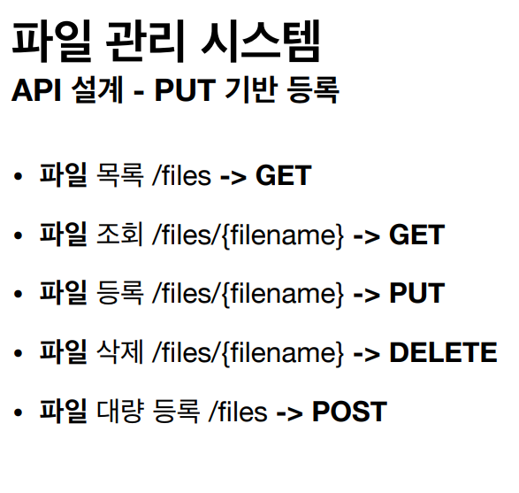

## HTTP 메서드 활용

### 클라이언트에서 서버로 데이터 전송

- 정적 데이터 조회
  • 이미지, 정적 텍스트 문서

- 동적 데이터 조회
  • 주로 검색, 게시판 목록에서 정렬 필터(검색어)

- HTML Form을 통한 데이터 전송
  • 회원 가입, 상품 주문, 데이터 변경
  - **GET, POST만 지원**

- HTTP API를 통한 데이터 전송
  • 회원 가입, 상품 주문, 데이터 변경
  • 서버 to 서버, 앱 클라이언트, 웹 클라이언트(Ajax)

#### POST

- 클라이언트는 등록될 리소스의 URI를 모른다.
  • 회원 등록 /members -> POST
  • POST /members
- 서버가 새로 등록된 리소스 URI를 생성해준다.
  • HTTP/1.1 201 Created
    Location: /members/100 
- 컬렉션(Collection)
  • 서버가 관리하는 리소스 디렉토리
  • 서버가 리소스의 URI를 생성하고 관리
  • 여기서 컬렉션은 /members

#### PUT

- 클라이언트가 리소스 URI를 알고 있어야 한다.
  • 파일 등록 /files/{filename} -> PUT
  • PUT /files/star.jpg
- 클라이언트가 직접 리소스의 URI를 지정한다.
- 스토어(Store)
  • 클라이언트가 관리하는 리소스 저장소
  • 클라이언트가 리소스의 URI를 알고 관리
  • 여기서 스토어는 /files