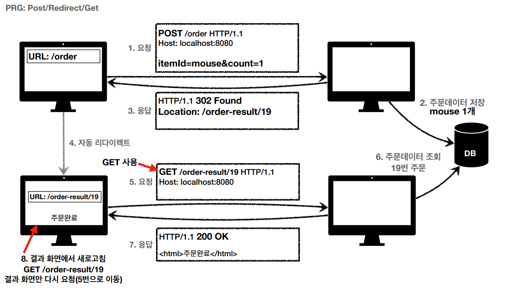

## 상태 코드

#### 클라이언트가 보낸 요청의 처리 상태를 응답에서 알려주는 기능

- **1xx (Informational): 요청이 수신되어 처리중**

- **2xx (Successful): 요청 정상 처리**

  - 200 OK

  요청 성공

  - 201 Created

  요청 성공해서 새로운 리소스가 생성됨

  - 202 Accepted

    요청이 접수되었으나 처리가 완료되지 않았음
    • 배치 처리 같은 곳에서 사용
    • 예) 요청 접수 후 1시간 뒤에 배치 프로세스가 요청을 처리함

  - 204 No Content

    서버가 요청을 성공적으로 수행했지만, 응답 페이로드 본문에 보낼 데이터가 없음
    • 예) 웹 문서 편집기에서 save 버튼
    • save 버튼의 결과로 아무 내용이 없어도 된다.
    • save 버튼을 눌러도 같은 화면을 유지해야 한다.
    • 결과 내용이 없어도 204 메시지(2xx)만으로 성공을 인식할 수 있다

- **3xx (Redirection): 요청을 완료하려면 추가 행동이 필요**

  

  #### 리다이렉션 이해

  영구 리다이렉션 - 특정 리소스의 URI가 영구적으로 이동
  	• 예) /members -> /users
  	• 예) /event -> /new-event
  일시 리다이렉션 - 일시적인 변경
  	• 주문 완료 후 주문 내역 화면으로 이동
  PRG: Post/Redirect/Get
  	• 특수 리다이렉션
  	• 결과 대신 캐시를 사용

  

  ​	• POST로 주문후에 새로 고침으로 인한 중복 주문 방지
  ​	• POST로 주문후에 주문 결과 화면을 GET 메서드로 리다이렉트
  ​	• 새로고침해도 결과 화면을 GET으로 조회
  ​	• 중복 주문 대신에 결과 화면만 GET으로 다시 요청

  

  - 300 Multiple Choices

  - 301 Moved Permanently - 영구 리다이렉션

    • 리다이렉트시 요청 메서드가 GET으로 변하고, 본문이 제거될 수 있음(MAY)  

  - 302 Found - 일시적인 리다이렉션

    • 리다이렉트시 요청 메서드가 GET으로 변하고, 본문이 제거될 수 있음(MAY) 

  - 303 See Other - 일시적인 리다이렉션

    • 302와 기능은 같음
    • 리다이렉트시 요청 메서드가 GET으로 변경

  - 304 Not Modified

    • 캐시를 목적으로 사용
    • 클라이언트에게 리소스가 수정되지 않았음을 알려준다. 따라서 클라이언트는 로컬PC에
    저장된 캐시를 재사용한다. (캐시로 리다이렉트 한다.)
    • 304 응답은 응답에 메시지 바디를 포함하면 안된다. (로컬 캐시를 사용해야 하므로)
    • 조건부 GET, HEAD 요청시 사용

  - 307 Temporary Redirect - 일시적인 리다이렉션

    • 302와 기능은 같음
    • 리다이렉트시 요청 메서드와 본문 유지(요청 메서드를 변경하면 안된다. MUST NOT) 

  - 308 Permanent Redirect - 영구 리다이렉션

    • 301과 기능은 같음
    • 리다이렉트시 요청 메서드와 본문 유지(처음 POST를 보내면 리다이렉트도 POST 유지)

- **4xx (Client Error): 클라이언트 오류, 잘못된 문법등으로 서버가 요청을 수행할 수 없음**

  - 400 Bad Request

    • 요청 구문, 메시지 등등 오류
    • 클라이언트는 요청 내용을 다시 검토하고, 보내야함
    • 예) 요청 파라미터가 잘못되거나, API 스펙이 맞지 않을 때

  - 401 Unauthorized

    • 인증(Authentication) 되지 않음
    • 401 오류 발생시 응답에 WWW-Authenticate 헤더와 함께 인증 방법을 설명
    • 참고
    	• 인증(Authentication): 본인이 누구인지 확인, (로그인)
    	• 인가(Authorization): 권한부여 (ADMIN 권한처럼 특정 리소스에 접근할 수 있는 권한, 인증이 있어야 인가가 있음)
    	• 오류 메시지가 Unauthorized 이지만 인증 되지 않음 (이름이 아쉬움)

  - 403 Forbidden

    • 주로 인증 자격 증명은 있지만, 접근 권한이 불충분한 경우
    • 예) 어드민 등급이 아닌 사용자가 로그인은 했지만, 어드민 등급의 리소스에 접근하는 경우

  - 404 Not Found

    • 요청 리소스가 서버에 없음
    • 또는 클라이언트가 권한이 부족한 리소스에 접근할 때 해당 리소스를 숨기고 싶을 때

- **5xx (Server Error): 서버 오류, 서버가 정상 요청을 처리하지 못함**

  - 500 Internal Server Error

    • 서버 내부 문제로 오류 발생
    • 애매하면 500 오류

  - 503 Service Unavailable

    • 서버가 일시적인 과부하 또는 예정된 작업으로 잠시 요청을 처리할 수 없음
    • Retry-After 헤더 필드로 얼마뒤에 복구되는지 보낼 수도 있음

  

