## HTTP 헤더 개요

**HTTP 표준**
**1999년 RFC2616**
**2014년 RFC7230~7235 등장**

### RFC723x 변화

- 엔티티(Entity) -> 표현(Representation)
- Representation = representation Metadata + Representation Data
- 표현 = 표현 메타데이터 + 표현 데이터

### HTTP BODY

- 메시지 본문(message body)을 통해 표현 데이터 전달

- 메시지 본문 = 페이로드(payload)

- 표현은 요청이나 응답에서 전달할 실제 데이터

- 표현 헤더는 표현 데이터를 해석할 수 있는 정보 제공

  • 데이터 유형(html, json), 데이터 길이, 압축 정보 등등

  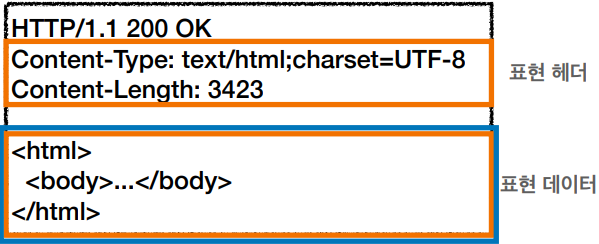

### 표현

- Content-Type: 표현 데이터의 형식

  - 미디어 타입, 문자 인코딩
  - 예)
    • text/html; charset=utf-8
    • application/json
    • image/png

  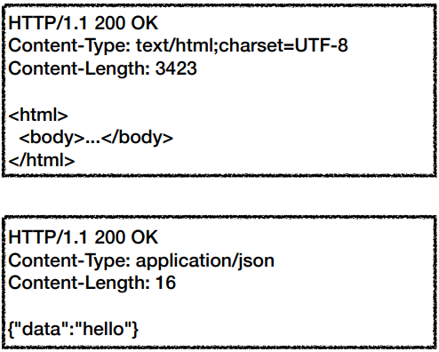

  

- Content-Encoding: 표현 데이터의 압축 방식

  - 표현 데이터를 압축하기 위해 사용
  - 데이터를 전달하는 곳에서 압축 후 인코딩 헤더 추가
  - 데이터를 읽는 쪽에서 인코딩 헤더의 정보로 압축 해제
  - 예)
    • gzip
    • deflate
    • identity

  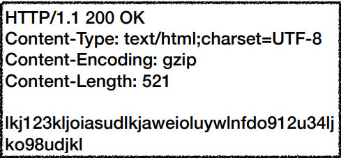

- Content-Language: 표현 데이터의 자연 언어

  - 표현 데이터의 자연 언어를 표현
  - 예)
    • ko
    • en
    • en-US

  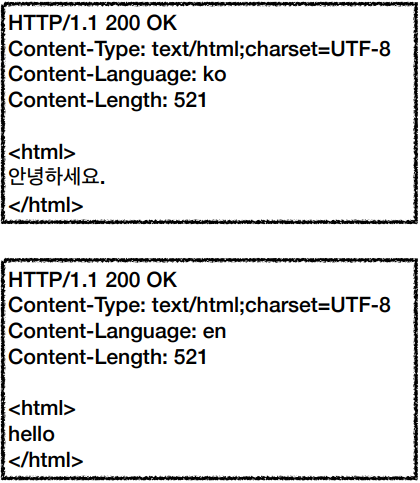

- Content-Length: 표현 데이터의 길이

  - 바이트 단위

  - Transfer-Encoding(전송 코딩)을 사용하면 Content-Length를 사용하면 안됨

    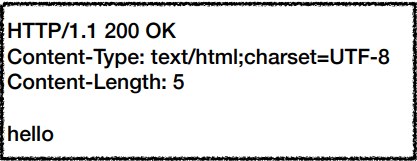

### 협상

- Accept: 클라이언트가 선호하는 미디어 타입 전달

- Accept-Charset: 클라이언트가 선호하는 문자 인코딩

- Accept-Encoding: 클라이언트가 선호하는 압축 인코딩

- Accept-Language: 클라이언트가 선호하는 자연 언어

- 협상과 우선순위

  - Quality Values(q) 값 사용

  - 0~1, 클수록 높은 우선순위

  - 생략하면 1

  - Accept-Language: ko-KR,ko;q=0.9,en-US;q=0.8,en;q=0.7

    • 1. ko-KR;q=1 (q생략)
    • 2. ko;q=0.9
    • 3. en-US;q=0.8
    • 4. en:q=0.7

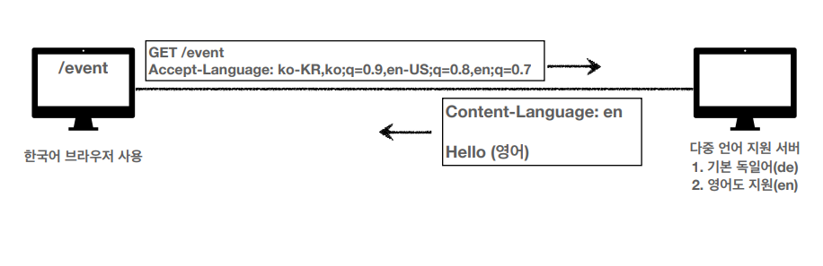

- 협상과 우선순위2
  - 구체적인 것이 우선한다.
  - Accept: text/*, text/plain, text/plain;format=flowed, */*
    1. text/plain;format=flowed
    2. text/plain
    3. text/*
    4. */*

### 전송방식

- 단순 전송

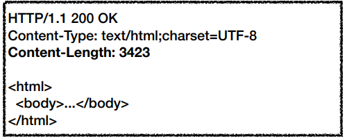

- 압축 전송

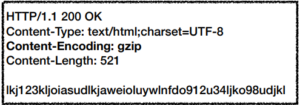

- 분할 전송

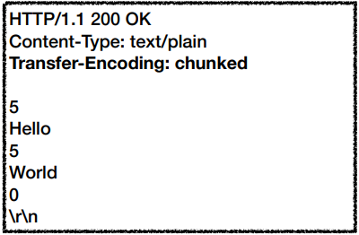

- 범위 전송

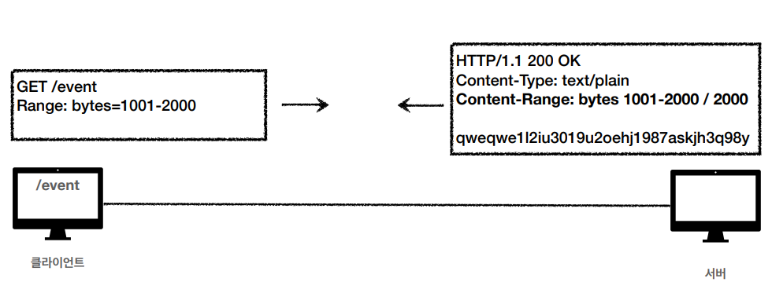

### 일반정보

- From: 유저 에이전트의 이메일 정보
- Referer: 이전 웹 페이지 주소
- User-Agent: 유저 에이전트 애플리케이션 정보
- Server: 요청을 처리하는 오리진 서버의 소프트웨어 정보
- Date: 메시지가 생성된 날짜

### 특별한 정보

- Host: 요청한 호스트 정보(도메인)
- Location: 페이지 리다이렉션
- Allow: 허용 가능한 HTTP 메서드
- Retry-After: 유저 에이전트가 다음 요청을 하기까지 기다려야 하는 시간

### 쿠키

- Set-Cookie: 서버에서 클라이언트로 쿠키 전달(응답)
- Cookie: 클라이언트가 서버에서 받은 쿠키를 저장하고, HTTP 요청시 서버로 전달

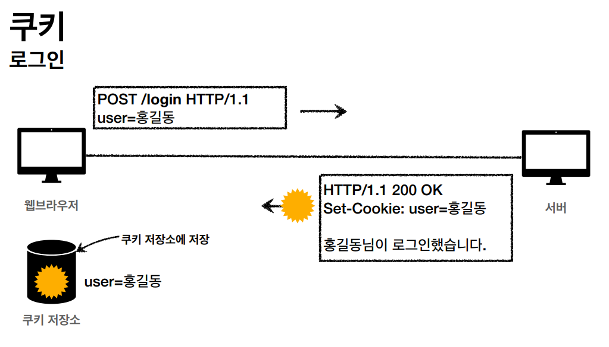

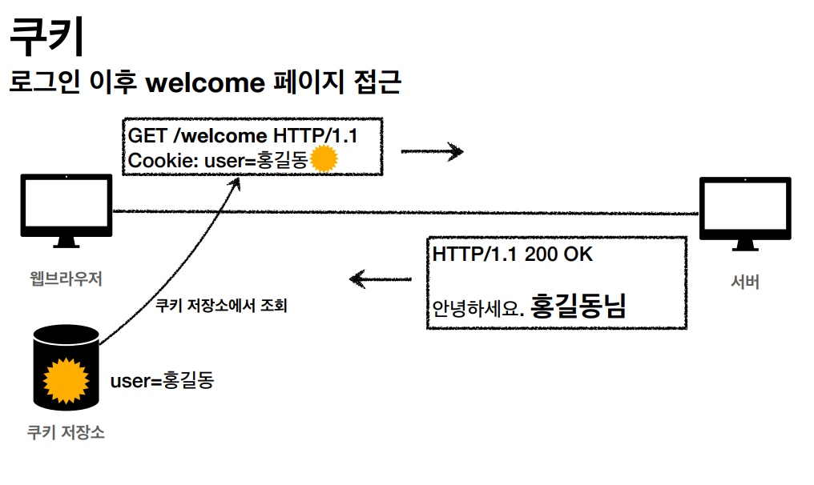

- 사용처

  • 사용자 로그인 세션 관리
  • 광고 정보 트래킹

- 쿠키 정보는 항상 서버에 전송됨
  • 네트워크 트래픽 추가 유발
  • 최소한의 정보만 사용(세션 id, 인증 토큰)
  • 서버에 전송하지 않고, 웹 브라우저 내부에 데이터를 저장하고 싶으면 웹 스토리지 (localStorage, sessionStorage) 참고

- 주의!
  • 보안에 민감한 데이터는 저장하면 안됨(주민번호, 신용카드 번호 등등)

#### 쿠키 - 생명주기

- Set-Cookie: expires=Sat, 26-Dec-2020 04:39:21 GMT
  • 만료일이 되면 쿠키 삭제
- Set-Cookie: max-age=3600 (3600초)
  • 0이나 음수를 지정하면 쿠키 삭제
- 세션 쿠키: 만료 날짜를 생략하면 브라우저 종료시 까지만 유지
- 영속 쿠키: 만료 날짜를 입력하면 해당 날짜까지 유지

#### 쿠키 - 도메인

- 예) domain=example.org
- 명시: 명시한 문서 기준 도메인 + 서브 도메인 포함
- domain=example.org를 지정해서 쿠키 생성
  - example.org는 물론이고
    • dev.example.org도 쿠키 접근
- 생략: 현재 문서 기준 도메인만 적용
  - example.org 에서 쿠키를 생성하고 domain 지정을 생략
    • example.org 에서만 쿠키 접근
    • dev.example.org는 쿠키 미접근

#### 쿠키 - 경로

- 예) **path=/home**
- 이 경로를 포함한 하위 경로 페이지만 쿠키 접근
- 일반적으로 path=/ 루트로 지정
- 예)
  • **path=/home** 지정
  • /home -> 가능
  • /home/level1 -> 가능
  • /home/level1/level2 -> 가능
  • /hello -> 불가능

#### 쿠키 - 보안

- Secure
  • 쿠키는 http, https를 구분하지 않고 전송
  • Secure를 적용하면 https인 경우에만 전송
- HttpOnly
  • XSS 공격 방지
  • 자바스크립트에서 접근 불가(document.cookie)
  • HTTP 전송에만 사용
- SameSite
  • XSRF 공격 방지
  • 요청 도메인과 쿠키에 설정된 도메인이 같은 경우만 쿠키 전송