## 캐시와 조건부 요청

### 캐시 기본동작

- 캐시가 없을 때
  - 데이터가 변경되지 않아도 계속 네트워크를 통해서 데이터를 다운로드 받아야 한다.
  - 인터넷 네트워크는 매우 느리고 비싸다.
  - 브라우저 로딩 속도가 느리다.
  - 느린 사용자 경험
- 캐시 적용
  - 캐시 덕분에 캐시 가능 시간동안 네트워크를 사용하지 않아도 된다.
  - 비싼 네트워크 사용량을 줄일 수 있다.
  - 브라우저 로딩 속도가 매우 빠르다.
  - 빠른 사용자 경험

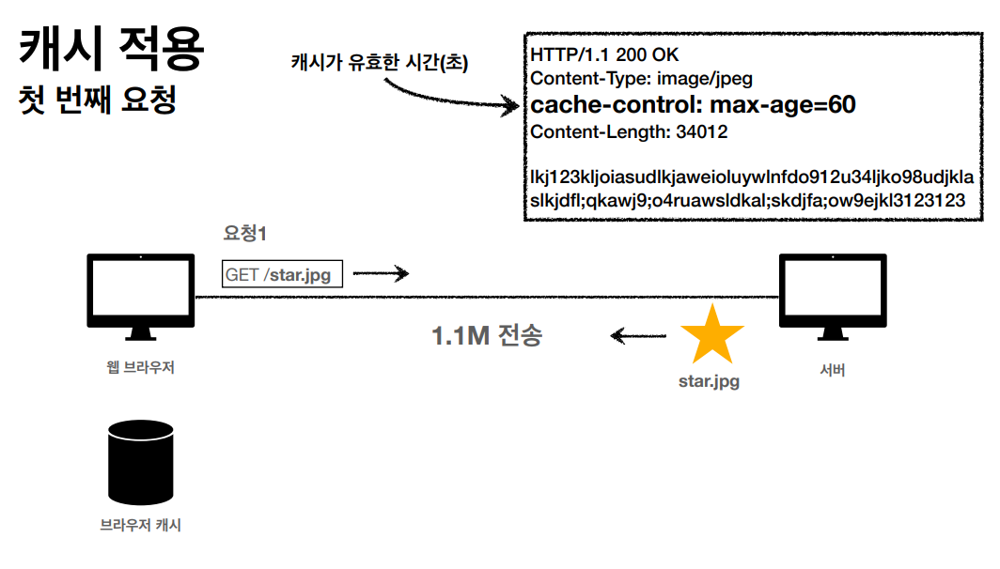

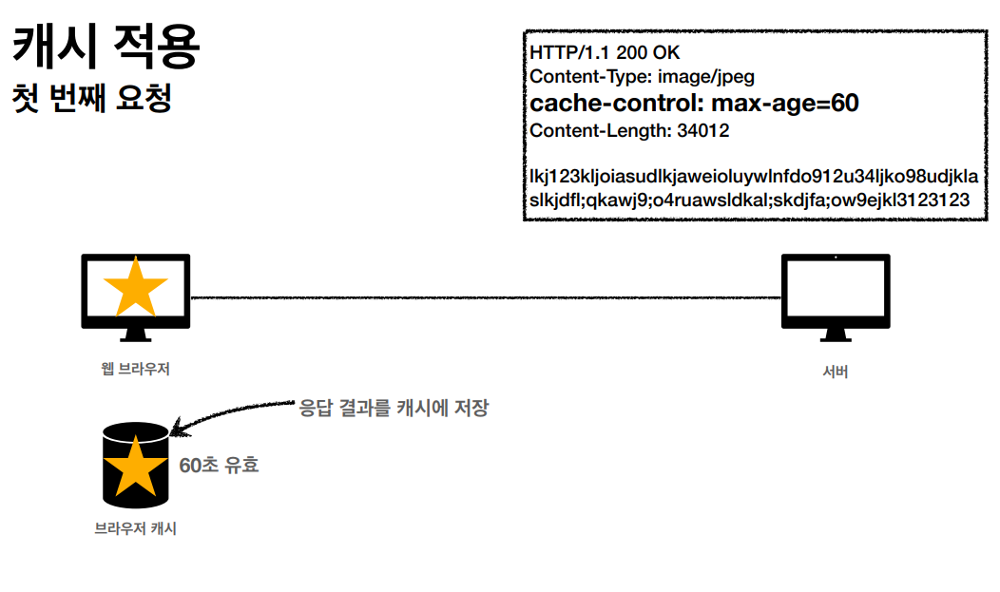

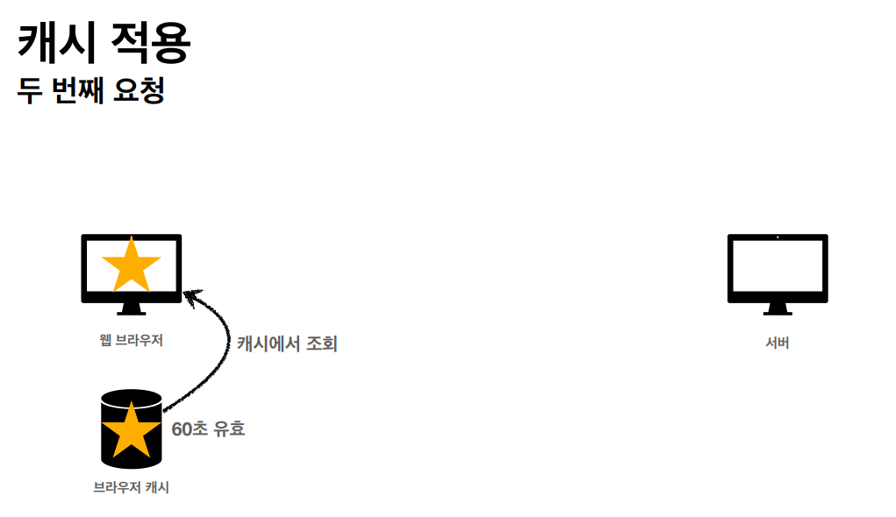

### 캐시 시간 초과

- 캐시 유효 시간이 초과하면, 서버를 통해 데이터를 다시 조회하고, 캐시를 갱신한다.

- 이때 다시 네트워크 다운로드가 발생한다.

- 캐시 만료후에도 서버에서 데이터를 변경하지 않음

  - 생각해보면 데이터를 전송하는 대신에 저장해 두었던 캐시를 재사용 할 수 있다.
  - 단 클라이언트의 데이터와 서버의 데이터가 같다는 사실을 확인할 수 있는 방법 필요

  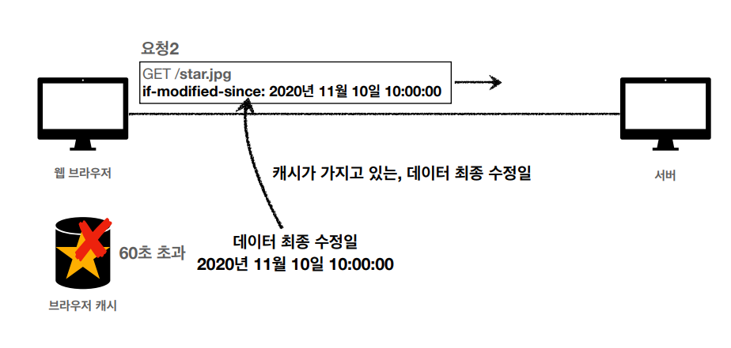

  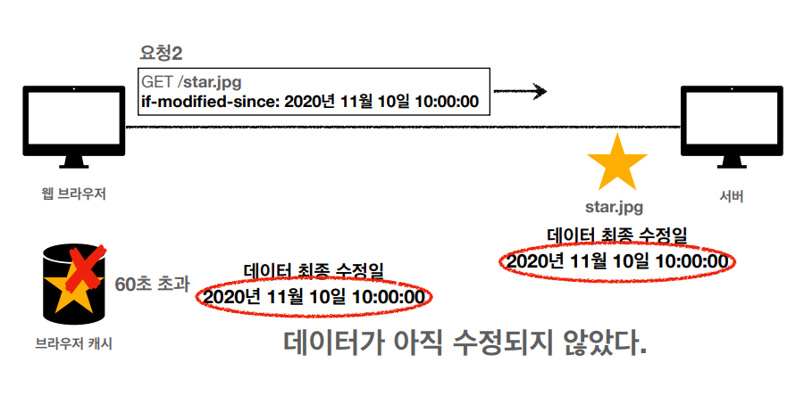

  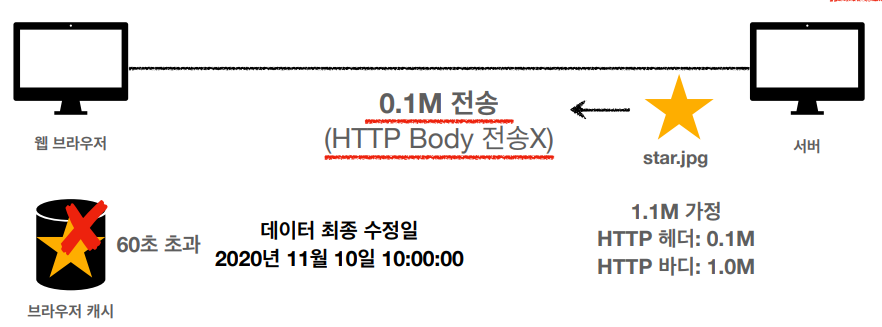

  ### 검증 헤더와 조건부 요청

  - 검증 헤더
    • 캐시 데이터와 서버 데이터가 같은지 검증하는 데이터
    • Last-Modified , ETag

  - 조건부 요청 헤더
    • 검증 헤더로 조건에 따른 분기
    • If-Modified-Since: Last-Modified 사용
    • If-None-Match: ETag 사용
    • 조건이 만족하면 200 OK
    • 조건이 만족하지 않으면 304 Not Modified
  - 데이터 미변경 예시
    • 캐시: 2020년 11월 10일 10:00:00 vs 서버: 2020년 11월 10일 10:00:00
    • 304 Not Modified, 헤더 데이터만 전송(BODY 미포함)
    • 전송 용량 0.1M (헤더 0.1M, 바디 1.0M)
  - 데이터 변경 예시
    • 캐시: 2020년 11월 10일 10:00:00 vs 서버: 2020년 11월 10일 11:00:00
    • 200 OK, 모든 데이터 전송(BODY 포함)
    • 전송 용량 1.1M (헤더 0.1M, 바디 1.0M)

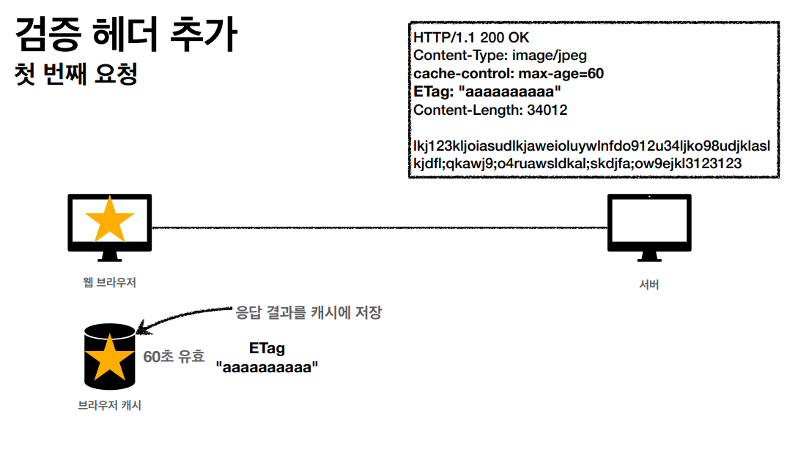

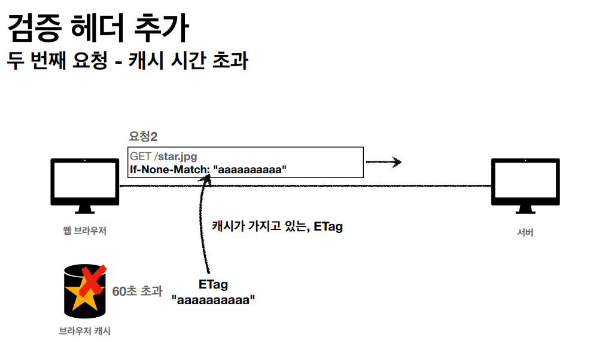

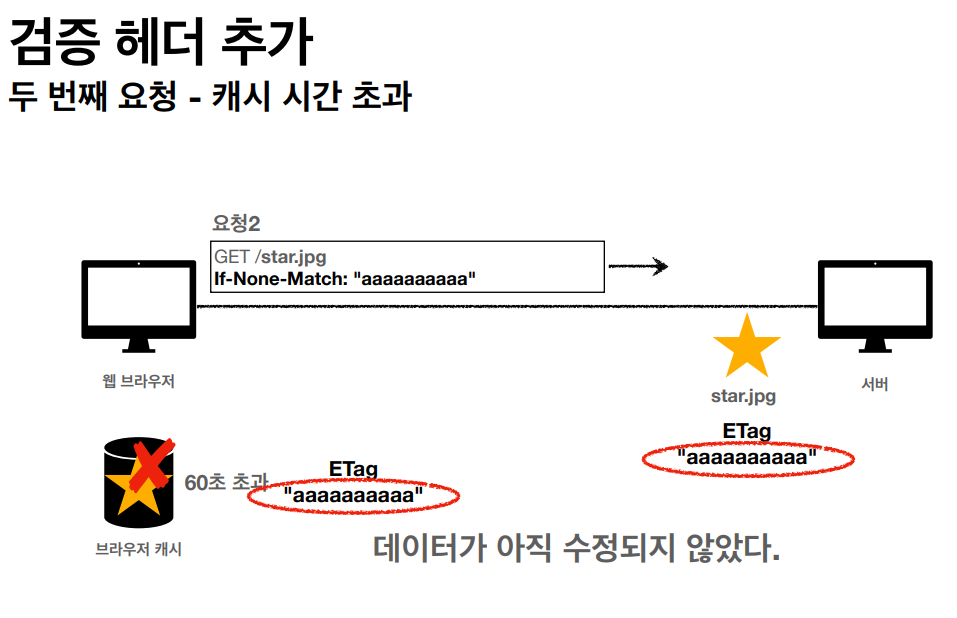

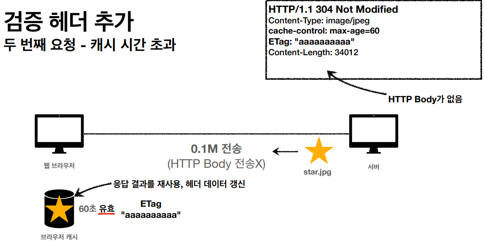

- 진짜 단순하게 ETag만 서버에 보내서 같으면 유지, 다르면 다시 받기!
- **캐시 제어 로직을 서버에서 완전히 관리**
- 클라이언트는 단순히 이 값을 서버에 제공(클라이언트는 캐시 메커니즘을 모름)
- 예)
  • 서버는 배타 오픈 기간인 3일 동안 파일이 변경되어도 ETag를 동일하게 유지
  • 애플리케이션 배포 주기에 맞추어 ETag 모두 갱신

### 캐시 제어 헤더

- Cache-Control: 캐시 제어
  - Cache-Control: max-age
    • 캐시 유효 시간, 초 단위
  - Cache-Control: no-cache
    • 데이터는 캐시해도 되지만, 항상 원(origin) 서버에 검증하고 사용
  - Cache-Control: no-store
    • 데이터에 민감한 정보가 있으므로 저장하면 안됨
    (메모리에서 사용하고 최대한 빨리 삭제)
- Pragma: 캐시 제어(하위 호환)
- Expires: 캐시 유효 기간(하위 호환)

### 프록시 캐시

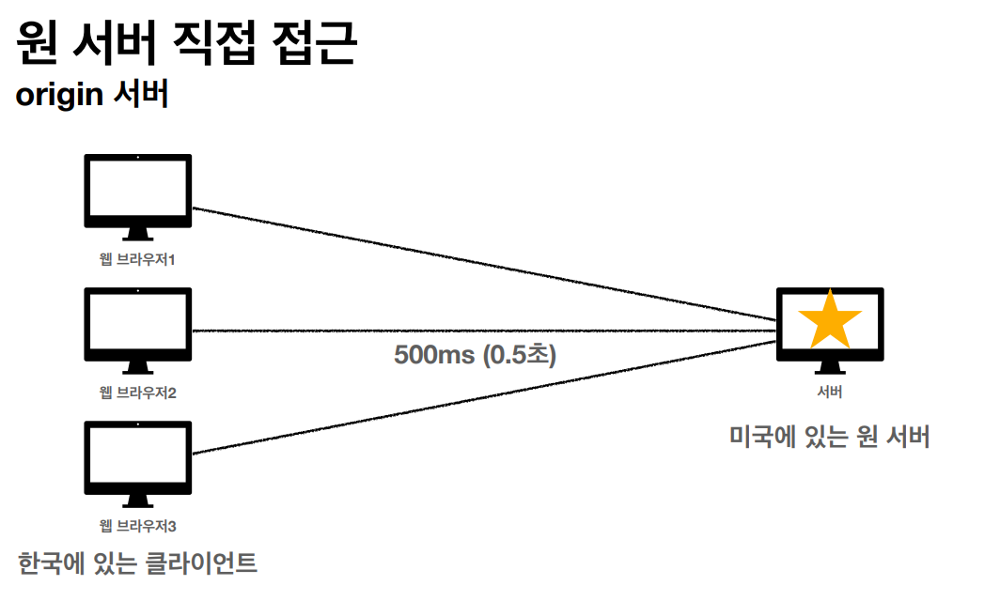

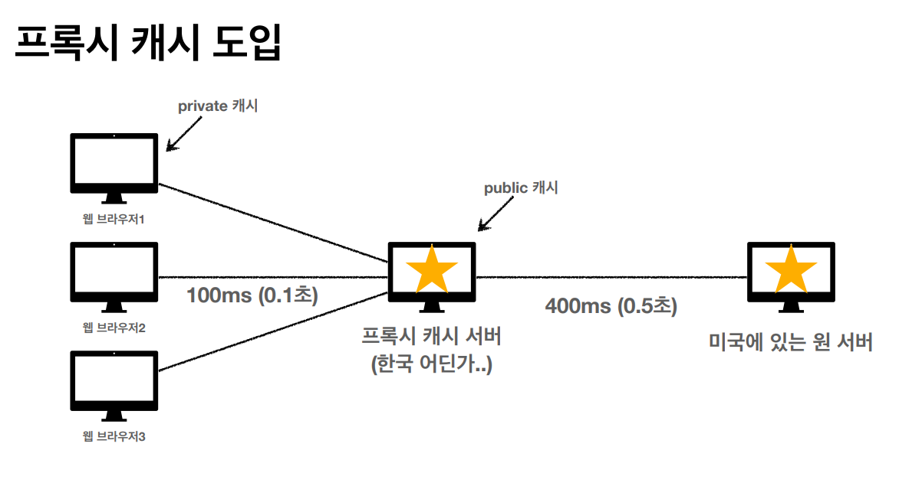

- Cache-Control - 캐시 지시어(directives)

  - Cache-Control: public 
    • 응답이 public 캐시에 저장되어도 됨
  - Cache-Control: private 
    • 응답이 해당 사용자만을 위한 것임, private 캐시에 저장해야 함(기본값)
  - Cache-Control: s-maxage 
    • 프록시 캐시에만 적용되는 max-age
  - Age: 60 (HTTP 헤더)
    • 오리진 서버에서 응답 후 프록시 캐시 내에 머문 시간(초)

  ### 캐시 무효화

  - Cache-Control: no-cache 
    • 데이터는 캐시해도 되지만, 항상 원 서버에 검증하고 사용(이름에 주의!)
  - Cache-Control: no-store 
    • 데이터에 민감한 정보가 있으므로 저장하면 안됨
    (메모리에서 사용하고 최대한 빨리 삭제)
  - Cache-Control: must-revalidate 
    • 캐시 만료후 최초 조회시 원 서버에 검증해야함
    • 원 서버 접근 실패시 반드시 오류가 발생해야함 - 504(Gateway Timeout)
    • must-revalidate는 캐시 유효 시간이라면 캐시를 사용함
  - Pragma: no-cache 
    • HTTP 1.0 하위 호환

  

